# <div align="center">🤖 Advanced AI Telegram Bot</div>

<div align="center">

[](https://www.python.org)
[](https://t.me/AdvChatGptBot)
[](https://www.mongodb.com/)
[](LICENSE)

</div>
<br>
<br>
<div align="center">
<a href="https://t.me/AdvChatGptbot" alt="Run Telegram Bot"> 
  
</a>
</div>
<br>
<br>
<div align="center">
  A powerful AI-driven Telegram bot that brings cutting-edge artificial intelligence features to your fingertips.
</div>

---

## ✨ Features

<table>
  <tr>
    <td align="center">💬</td>
    <td><b>AI Chat</b><br>Natural conversations powered by GPT-4o and other models</td>
    <td align="center">🎨</td>
    <td><b>Image Generation</b><br>Create stunning images from text descriptions, with /img and inline mode</td>
  </tr>
  <tr>
    <td align="center">🔊</td>
    <td><b>Voice Processing</b><br>Two-way voice message and text conversion (speech-to-text, text-to-speech)</td>
    <td align="center">📝</td>
    <td><b>Text Extraction (img2text)</b><br>Extract text, solve MCQs, and answer questions from images and documents</td>
  </tr>
  <tr>
    <td align="center">🌐</td>
    <td><b>Multi-language Support</b><br>Communicate in your preferred language, with translation and language settings</td>
    <td align="center">👥</td>
    <td><b>Group Integration</b><br>Full AI functionality in group chats, with group-specific settings</td>
  </tr>
  <tr>
    <td align="center">📱</td>
    <td><b>Inline Mode</b><br>Generate AI responses and images in any chat, with advanced inline query handling</td>
    <td align="center">⚡</td>
    <td><b>Fast, Reliable Delivery</b><br>Optimized for quick, robust interactions, including large code/image snippets</td>
  </tr>
  <tr>
    <td align="center">🗂️</td>
    <td><b>File-to-Text (img2text)</b><br>Upload images or documents and interact with their content via AI</td>
    <td align="center">⏳</td>
    <td><b>Image Context Expiry</b><br>Uploaded images for vision/AI analysis are auto-deleted after 2 minutes (configurable)</td>
  </tr>
  <tr>
    <td align="center">🔒</td>
    <td><b>Premium Model Handling</b><br>Premium AI/image models are shown only to eligible users</td>
    <td align="center">🛡️</td>
    <td><b>Admin Tools</b><br>Broadcast images (/share), code snippets (/snippet), ban/unban, premium management, logs, and more</td>
  </tr>
  <tr>
    <td align="center">🧩</td>
    <td><b>Multi-Bot Support</b><br>Run multiple bots with isolated sessions and MongoDB fork safety</td>
    <td align="center">🧠</td>
    <td><b>Advanced Prompting</b><br>Smart prompt logic for images, MCQs, and document Q&A</td>
  </tr>
</table>

> 📱 **Try it now**: [t.me/AdvChatGptBot](https://t.me/AdvChatGptBot)

## 🚀 Quick Start

```bash
# Clone repository
git clone https://github.com/TechyCSR/AdvAITelegramBot.git

# Navigate to directory
cd AdvAITelegramBot

# Set up virtual environment
python -m venv .venv
source .venv/bin/activate  # On Windows: .venv\Scripts\activate

# Install dependencies
pip install -r requirements.txt

# Configure your bot
cp config.example.py config.py
# Edit config.py with your API credentials

# Launch!
python run.py
```

## 📋 Commands

| Command | Description |
|---------|-------------|
| `/start` | 🏁 Start a conversation with the bot |
| `/help` | ❓ Get help and see available commands |
| `/settings` | ⚙️ Adjust preferences, language, and models |
| `/img [prompt]` or `/generate [prompt]` | 🎨 Generate an image from text |
| `/newchat`, `/reset`, `/new`, `/clear_chat` | 🔄 Start a new conversation |
| *Upload image/document* | 📝 Extract text, solve MCQs, or ask questions about content |

**How to use:**
- Upload an image or document in private chat to extract text, solve MCQs, or ask questions about its content. Only one image context is active per user; uploading a new image replaces the previous one. Images are auto-deleted after 2 minutes (user is notified).
- For image generation, the bot always replies with a `/img` command snippet and clear copy-paste instructions.
- All code/image snippets are delivered unbroken, using HTML formatting for reliability.

## 🛠️ Configuration

Edit `config.py` with the following fields:

```python
BOT_TOKEN = "your_telegram_bot_token"  # From BotFather
API_KEY = "your_telegram_api_key"      # From my.telegram.org
API_HASH = "your_telegram_api_hash"    # From my.telegram.org
DATABASE_URL = "mongodb://localhost:27017/"  # MongoDB connection string
ADMINS = [123456789]  # List of Telegram user IDs with admin rights
# Optional advanced settings:
IMAGE_CONTEXT_EXPIRY_MINUTES = 2        # Minutes before uploaded images are auto-deleted
PREMIUM_MODELS = ["gpt-4o", "dalle3", ...] # List of premium models (shown only to premium users)
MULTI_BOT = True                        # Enable multi-bot support (one process per bot)
```

- For multi-bot, provide multiple `BOT_TOKEN`s and set `MULTI_BOT = True`.
- For MongoDB fork safety, each process creates its own MongoClient.
- All settings are documented in `config.py`.

## 🧠 Usage Notes

- **Image/Document Upload:**
  - Upload an image or document, then ask questions, solve MCQs, or request a description.
  - If a caption is present, it is used as the prompt; otherwise, the bot will prompt the AI to answer questions, solve MCQs, or describe the image.
  - Only one image context is active per user; uploading a new image replaces the previous one.
  - Images are auto-deleted after expiry, and the user is notified.

- **AI Prompting:**
  - The bot is aware of all its capabilities (text, image, vision, MCQ, document, multi-model).
  - For any image generation request, the bot always replies with a `/img` command snippet and clear copy-paste instructions.

- **Code/Prompt Snippets:**
  - Code and image generation snippets are always delivered unbroken, using HTML formatting for reliability.

## 🏗️ System Architecture

A simple, user-friendly architecture that powers all the bot's amazing features.

```mermaid
graph TD
    %% Users
    USER[👤 Users] 
    
    %% User Interfaces - Simplified
    subgraph "📱 How Users Interact"
        TELEGRAM[💬 Telegram Chat]
        WEBAPP[🌐 Web App]  
        INLINE[⚡ Inline Mode]
    end
    
    %% Main System
    subgraph "🤖 Main Bot System"
        BOT[🧠 AI Bot Brain]
        QUEUE[📋 Request Handler]
    end
    
    %% AI Services - Main Categories Only
    subgraph "🎯 AI Services"
        TEXTAI[💭 Text AI<br/>Chat & Responses]
        IMAGEAI[🎨 Image AI<br/>Generate & Analyze]
        VOICEAI[🔊 Voice AI<br/>Speech Processing]
        VIDEOAI[🎬 Video AI<br/>Video Creation]
    end
    
    %% Core Features
    subgraph "⚙️ Core Features"
        USERS[👥 User Management]
        GROUPS[🏢 Group Features]
        ADMIN[👑 Admin Tools]
    end
    
    %% External AI Providers
    subgraph "🌐 AI Providers"
        GPT[🧠 OpenAI GPT-4o]
        POLLINATIONS[🎨 Pollinations AI]
        DEEPINFRA[⚡ DeepInfra]
    end
    
    %% Database
    subgraph "💾 Data Storage"
        MONGODB[(🗄️ MongoDB Database)]
        FILES[📁 Generated Files]
    end
    
    %% Simple Connections
    USER --> TELEGRAM
    USER --> WEBAPP
    USER --> INLINE
    
    TELEGRAM --> BOT
    WEBAPP --> BOT
    INLINE --> BOT
    
    BOT --> QUEUE
    QUEUE --> TEXTAI
    QUEUE --> IMAGEAI
    QUEUE --> VOICEAI
    QUEUE --> VIDEOAI
    
    BOT --> USERS
    BOT --> GROUPS
    BOT --> ADMIN
    
    TEXTAI --> GPT
    TEXTAI --> DEEPINFRA
    IMAGEAI --> POLLINATIONS
    IMAGEAI --> GPT
    VOICEAI --> GPT
    VIDEOAI --> POLLINATIONS
    
    BOT --> MONGODB
    IMAGEAI --> FILES
    VOICEAI --> FILES
    VIDEOAI --> FILES
    
    %% Clean Styling with High Contrast
    classDef user fill:#2E3440,stroke:#88C0D0,stroke-width:3px,color:#ECEFF4
    classDef interface fill:#5E81AC,stroke:#81A1C1,stroke-width:3px,color:#ECEFF4
    classDef system fill:#8FBCBB,stroke:#88C0D0,stroke-width:3px,color:#2E3440
    classDef ai fill:#EBCB8B,stroke:#D08770,stroke-width:3px,color:#2E3440
    classDef features fill:#A3BE8C,stroke:#B48EAD,stroke-width:3px,color:#2E3440
    classDef external fill:#BF616A,stroke:#D08770,stroke-width:3px,color:#ECEFF4
    classDef data fill:#B48EAD,stroke:#5E81AC,stroke-width:3px,color:#ECEFF4
    
    class USER user
    class TELEGRAM,WEBAPP,INLINE interface
    class BOT,QUEUE system
    class TEXTAI,IMAGEAI,VOICEAI,VIDEOAI ai
    class USERS,GROUPS,ADMIN features
    class GPT,POLLINATIONS,DEEPINFRA external
    class MONGODB,FILES data
```




#### **🎯 Main Components**

| Component | What It Does | Example |
|-----------|-------------|---------|
| 💭 **Text AI** | Smart conversations and responses | *"Tell me about space"* → Detailed explanation |
| 🎨 **Image AI** | Creates and analyzes images | *"/img sunset beach"* → Beautiful beach sunset image |
| 🔊 **Voice AI** | Speech-to-text and text-to-speech | Voice message → Text transcription |
| 🎬 **Video AI** | AI-powered video generation | Text prompt → Generated video |
| 👥 **User Management** | Handles accounts, settings, premium | User preferences, premium features |
| 🏢 **Group Features** | Group chat functionality | Group settings, permissions |
| 👑 **Admin Tools** | Bot management and monitoring | Statistics, user management |

#### **💡 Key Benefits**
- **⚡ Fast**: Smart request handling prevents delays
- **🧠 Intelligent**: Multiple AI models for best results  
- **📱 Accessible**: Works on Telegram, web, and inline mode
- **🔒 Secure**: User data protected in MongoDB database
- **🎯 Reliable**: Queue system handles high traffic
- **🌍 Global**: Multi-language support for everyone

## 🛠️ Setup Guide

### System Requirements

- Python 3.8 or higher
- MongoDB (local or cloud instance)
- Telegram Bot Token from BotFather
- 1GB+ RAM recommended for image generation

### Detailed Installation

<details>
<summary>1. Environment Setup</summary>

```bash
# Make sure you have Python 3.8+ installed
python --version

# Create and activate virtual environment
python -m venv .venv
source .venv/bin/activate  # On Windows: .venv\Scripts\activate
```
</details>
<details>
<summary>2. Install Dependencies</summary>

```bash
# Install required packages
pip install -r requirements.txt

# Verify installations
pip list
```
</details>

<details>
<summary>3. Configuration</summary>

Create a `config.py` file with your credentials:

```python
BOT_TOKEN = "your_telegram_bot_token"  # From BotFather
API_KEY = "your_telegram_api_key"      # From my.telegram.org
API_HASH = "your_telegram_api_hash"    # From my.telegram.org
DATABASE_URL = "mongodb://localhost:27017/"
ADMINS = [123456789]  # Your Telegram user ID
# Optional advanced settings:
IMAGE_CONTEXT_EXPIRY_MINUTES = 2        # Minutes before uploaded images are auto-deleted
PREMIUM_MODELS = ["gpt-4o", "dalle3", ...] # List of premium models (shown only to premium users)
MULTI_BOT = True                        # Enable multi-bot support (one process per bot)
```
</details>

<details>
<summary>4. Database Setup</summary>

```bash
# Start MongoDB (if using local instance)
mongod --dbpath /path/to/data/db

# The bot will automatically create required collections
```
</details>

<details>
<summary>5. Running the Bot</summary>

```bash
# Start the bot
python run.py

# For production deployment
# Consider using systemd, Docker, or PM2
```
</details>

## 🔧 Advanced Configuration

<details>
<summary>Docker Deployment</summary>

```bash
# Build the Docker image
docker build -t advai-telegram-bot .

# Run the container
docker run -d --name advai-bot advai-telegram-bot
```
</details>

<details>
<summary>Environment Variables</summary>

You can use environment variables instead of config.py:

```bash
export BOT_TOKEN="your_telegram_bot_token"
export API_KEY="your_telegram_api_key"
export API_HASH="your_telegram_api_hash"
export DATABASE_URL="mongodb://localhost:27017/"
```
</details>

## 💻 Technologies

- [**Pyrogram**](https://docs.pyrogram.org/): Modern, fast, and elegant Telegram client library for Python.
- [**MongoDB**](https://www.mongodb.com/): Scalable NoSQL database for user data and bot state.
- [**OpenAI GPT-4o & Vision**](https://platform.openai.com/docs/models/gpt-4o): Advanced language and vision models for text, image, and document understanding.
- [**Docker**](https://www.docker.com/): Containerization for easy deployment and scaling.
- [**Python 3.8+**](https://www.python.org/): The core language powering all features and async operations.

## 🤝 Contributing

Contributions are welcome! Check out our [Contributing Guide](CONTRIBUTING.md) to get started.

<details>
<summary>Development Workflow</summary>

1. Fork the repository
2. Create a feature branch: `git checkout -b feature/amazing-feature`
3. Commit your changes: `git commit -m 'Add amazing feature'`
4. Push to the branch: `git push origin feature/amazing-feature`
5. Open a Pull Request
</details>

## 📝 License

This project is licensed under the MIT License - see the [LICENSE](LICENSE) file for details.

---


<div align="center">
  Made with ❤️ by @TechyCSR
  <br>
  <a href="https://techycsr.me">Website</a> •
  <a href="https://x.com/techycsr">Twitter</a> •
  <a href="https://linkedin.com/in/techycsr">LinkedIn</a>
</div> 
